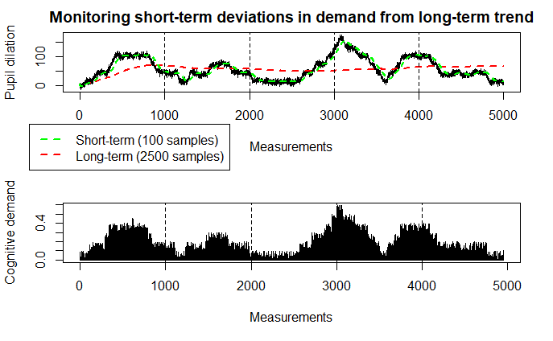

# Maintaining steady driver workload with adaptive automation

## Table of contents

1. [Introduction](#introduction)
2. [Hypotheses](#hypotheses)
3. [Experiment](#experiment-test-of-system)
4. [Levels of automation](#levels-of-automation)
5. [Assessments](#assessments)
6. [Application modules](#application-modules)
7. [References](#references)
8. [Answers to questions](#answers-to-questions)

## Introduction

This project concerns itself with the adaptive automation of a simulated driving task. Relying on an existing driving model implemented in ACT-R, we will research and develop a real-time automation system that will determine when the model should take over partial or full control of the driving task and when control should be handed back to the human driver. The adaptive automation system will attempt to maintain a stable driver mental workload.

## Hypotheses

We hypothesize that increases in automation will reduce the driver’s workload. Based on this we expect adaptive automation to lead to a more stable mental workload over time. Additionally, we hypothesize that we will be observing an improvement in human driving performance measures due to adaptive automation. It is likewise possible that we will mainly observe an improvement in the performance on a secondary task due to adaptive automation since subjects might be able to focus more on that secondary task when the model is in (partial) control of the driving task.

## Experiment (Test of System)

To test these hypotheses, our experimental setup needs to account for multiple aspects: the participants, experiment design, and the type of follow-up analyses. For this experiment, we aim at having two experimental within-subjects conditions (aided vs. unaided): in the aided condition the adaptive automation system will be enabled, while in the unaided condition the driver remains in full control for the entire session. Additionally, we need to manipulate the load on the driver in both conditions to test whether our adaptive automation system takes over control in appropriate moments and how the increase in automation will impact the driver. To manipulate the load on the driver we will let the participants complete a secondary task: Solving multiplication problems. These problems will be presented to the participants with a text-to-speech synthesizer, so participants will still be able to watch the road, which allows us to continue to monitor changes in the size of the pupil. Participants can respond to the problems using their voice, and we will record their responses manually.

To create concrete switches between light and heavy mental workload, within each aided/unaided condition, periods in which the participant will be asked to solve multiplication problems are alternated with periods in which the participant is not asked to solve problems. More specifically, the experiment schedule looks as follows:

1. 5-minute introduction session where the experimental information is presented

2. 10-minute driving session (Session 1)

    1. 2.5-minute without algebra problems 
    2. 2.5-minute with algebra problems 
    3. 2.5-minute without algebra problems 
    4. 2.5-minute with algebra problems

3. 5-minute break

4. 10-minute driving session (Session 2)

    1. 2.5-minute without algebra problems
    2. 2.5-minute with algebra problems
    3. 2.5-minute without algebra problems
    4. 2.5-minute with algebra problems

To prevent any effect of specific multiplication problems on pupil size and/or driving performance, two different lists of multiplication problems will be created and counterbalanced across the participants. Similarly, to prevent any learning effects, we will also have to counterbalance the aided/unaided conditions across participants. This yields 2*2=4 different experiment run configurations, as detailed in the table below. This means that we will recruit a number of participants dividable by four, so every configuration will be associated with the same number of participants.

| Session 1 (automation condition) | Session 2 (automation condition) | Session 1 (multiplication list) | Session 2 (multiplication list) |
|----------------------------------|----------------------------------|---------------------------------|---------------------------------|
| Aided                            | Unaided                          | List 1                          | List 2                          |
| Aided                            | Unaided                          | List 2                          | List 1                          |
| Unaided                          | Aided                            | List 1                          | List 2                          |
| Unaided                          | Aided                            | List 2                          | List 1                          |

## Levels of Automation

In order to successfully drive a car, two distinct types of control need to be performed. The first type, called lateral control, concerns itself with the sideways motion of the vehicle, and thus with how well a car can keep in its designated lane, or switch lanes when necessary. A driver performs lateral control by turning the steering wheel to influence the direction of the car. The second type, called longitudinal control, concerns itself with the velocity of the vehicle and thus also with the distance to other vehicles, either in front or behind. A driver performs longitudinal control by pressing their foot on the gas or brake pedal to influence the speed of the vehicle.

These distinct types of control allow for various levels of automation. The lowest level of automation is when the driver is responsible for both types of control and is thus in full control of the vehicle (from now on referred to as no—automation). When the vehicle, or more specifically the model, takes over longitudinal control, we speak of partial automation. The model takes over longitudinal control, and not lateral, as this type of driver assistance is well-known, under the name cruise control, and participants will not have to get used to it. The highest level of automation is when the vehicle is responsible for both lateral and longitudinal control, we call this full automation.

The terminology used does differ from a well-known taxonomy of levels of automation as determined by a committee of the Society of Automotive Engineers (SAE) (ORAD committee, 2018). This includes monitoring of the vehicle and the environment under automated activity as a driver task and takes this into account when determining the level of automation. As we, for this project/experiment, assume that the model performs correctly, this supervision while relying on the vehicle for either or both types of control does not play a part in our definition, and is not even considered a task of the driver. The SAE would classify our definition of partial automation as Driver Assistance (level 1) and our definition of full automation as either Partial Driving Automation (level 2), Conditional Driving Automation (level 3), High Driving Automation (level 4), or Full Driving Automation (level 5) dependent on whether the driver can overrule the car's decisions, needs to supervise or has to be able/ready to intervene.

Currently, we have implemented three different levels of automation:

1. No automation, driver has full control.
2. Partial automation in the form of cruise control: The driver can still steer the vehicle, but the speed is being controlled by the ACT-R model.
3. Full automation, ACT-R controls both steering and speed.

## Assessments

To answer our hypotheses and to monitor the load on the driver we first need to quantify driving performance and cognitive load. Regarding the former, we could consider multiple measures such as the time it takes to change lanes, the lateral deviations from the middle of the lane, deviations from speed limits (based on Savino, 2009), reaction times, and gap acceptance (Papantoniou, Papadimitriou, and Yannis, 2017). We will monitor a selection of these measures continuously during experimental sessions.

Driving performance in the unaided condition can then be compared to driving performance during no-automation periods in the aided condition. Additionally, driving performance measures unrelated to the actions taken over by the model during partial-automation in the aided condition can be compared to the same measures in the unaided condition (see example 1).

Example 1: the above-mentioned deviations from the speed limit while the model performs lateral control can still be compared to the deviations measured in the unaided condition since this depends exclusively on longitudinal control which is still performed by the driver.

Apart from relying on these driving performance measures, the adaptive automation system also should have access to a more direct measure of the mental/cognitive load currently experienced by the user. We will rely on Pupil dilation as such an indicator of cognitive load (Kahneman, 1973). Thus, we will also continuously measure the size of the driver’s pupil. One approach to detect changes in cognitive demand is to monitor both short-term and long-term changes in the size of the pupil (see example 2, Mindakis & Lohan, 2018).

Example 2:

Example 2 shows resulting changes in pupil dilation (black, top panel) based on given changes in demand (lower panel) simulated using the pupil model by Hoeks & Levelt (1993). Keeping track of short-term deviations (green line, top panel) from the long-term trend in the size of the pupil (red line, top panel) by means of moving averages (Mindakis & Lohan, 2018) allows identifying the prolonged episodes of increased demand quite well. The adaptive automation system could then increase the level of automation if a significant short-term deviation from the long-term trend occurs. Similarly, the automation level could be decreased once the short-term demand gravitates towards the long-term trend again. Assuming that this would indeed lower the driver’s workload, the short-term changes in the size of the pupil should then begin to gravitate back towards the long-term trend which approximates the average size of the pupil during the recorded period quite well. The automation level could then again be decreased once the short-term changes have sufficiently converged back towards the long-term trend.

As part of the final statistical analysis, we will investigate how the size of the pupil changes over time, following a change in the level of automation. This will allow us to assess whether the changes in the level of automation are actually associated with a change in the size of the pupil reflecting demand.

## Application modules

Our application can be divided up into four major parts:

1. Eye-tracking (for the purpose of measuring pupil dilation).
2. Simulation measures of driving performance.
3. Decision mechanism that combines all measures and decides on a level of automation.
4. The implementation of the levels of automation.

### Eye-tracking

In some way or another, the adaptive automation decision system will depend on the pupil size. Thus, we will repeatedly query the pupil dilation from the eye-tracking device. We will have to make decisions about the sampling rate here.

### Simulation measures

As discussed in the assessment section, a plethora of car control measures exists that are typically taken to assess driving performance in real life. Although most of these measures should be available from the simulation, some might be more easily accessible than others, so we will need to strike a balance between how informative a measure is (based on the literature) and how easy it is to monitor it.

Currently, we are not yet using these simulation measures to decide on the automation level.

### Decision mechanism

Once the pupil dilation data and driving performance measures have been collected, they need to be used to decide on an appropriate level of automation. In the assessment section, we already outlined how we could take the pupil size measurements into account. To incorporate the driving performance measures we could rely on a variety of ways including handcrafted if-then rules, a set of SVMs, a Bayesian network, et cetera. It would be preferred if the mechanism that we will eventually use maintains transparency w.r.t. how it reached the conclusion that it should activate automation level X given the data. In other words, preserving explainability would be nice.

At the moment of writing, the decision mechanism only bases its decision on the pupil dilation, as detailed in the Assessments section.

### Implementation of automation levels

We use the existing ACT-R model to automate the driving process. Since we sometimes want to use no or only partial automation, certain parts of the ACT-R model are sometimes ignored when controlling the car. Previously, we worried that ACT-R might not be able to adapt to situations in which its output is ignored, but as it turns out, the ACT-R model has no problem recovering from the no and partial automation levels.

Although we have already implemented visual changes signifying the current level of automation, a system that warns the user that the information level is about to change still needs to be implemented.

## References

Papantoniou, P., Papadimitriou, E., & Yannis, G. (2017). Review of driving performance parameters critical for distracted driving research. Transportation Research Procedia, 25, 1796–1805.

On-Road Automated Driving (ORAD) committee (2018). Taxonomy and Definition for Terms Related to Driving Automation System for On-Road Motor Vehicles. Available from https://doi.org/10.4271/J3016_201609

Hoeks, B., Levelt, W. (1993) Pupillary dilation as a measure of attention: A quantitative system analysis
Mindakis, G., Lohan, K. (2018) Using Pupil Diameter to Measure Cognitive Load

Savino M. R. (2009) Standardized Names and Definitions for Driving Performance Measures
Kahneman, D. (1973) Attention and Effort

## Answers to questions

**Gilles' question**:

Good question! We want to measure pupil dilation as a proxy for cognitive load, to determine whether the driver might be needing some driving assistance. However, the term ‘cognitive load’ is poorly defined, and could be interpreted as 1) increased competition for specific resources or 2) increased usage of cognitive resources overall (but without increased competition). Whatever the interpretation, we think we can ensure that pupil dilation changes with our secondary task. We will argue why we think so for both interpretations of cognitive load:

1) It is true that the secondary task we have planned (answering questions about an English listening test) uses a different perception modality (hearing) than the primary task (vision), but that does not mean that the different tasks do not draw on the same resources. While driving, participants need to focus on the approaching speed sign to read its contents (which is actually not that trivial) and then remember the speed limit they just saw. While listening to the audio file, they need to concentrate on its contents and remember it to properly answer the questions we will ask them. Attention and declarative/working memory should therefore be used in both tasks and cause some interference between the two, which should increase cognitive load according to definition 1) and therefore be reflected in the pupil size.

2) Increased demands on cognitive control alone, which includes task switching, already increases the pupil size (van der Wel & van Steenbergen, 2018). As long as the participants have not mastered either of the tasks to the degree that they can perform it fully automatically (which we believe they will not be able to do in the time frame of the experiment), doing the two tasks together should increase the pupil size because they will need to switch between them regularly.

Finally, if the current secondary task does turn out to be too easy and barely change pupil size, we will definitely consider using the n-back task (perhaps even in combination with the listening task).

PS Thanks for your offer to help! We will keep it in mind :)

*References*

van der Wel P, van Steenbergen H. Pupil dilation as an index of effort in cognitive control tasks: A review. Psychon Bull Rev. 2018 Dec;25(6):2005-2015. doi: 10.3758/s13423-018-1432-y. PMID: 29435963; PMCID: PMC6267528.

**Leander's question**:

Thank you for your questions! With regard to your first consideration: In an earlier draft of our experiment setup we, among ourselves, also discussed having a short practice session, and this indeed might still be a good idea. As of this week, we have actually played around with the driving simulator using a steering wheel and pedals and we found that performing a 0-back task (i.e. keeping the current speed limit) is not all that difficult. 2-back however was quite challenging. Considering that the 0-back task was not that difficult, and that most people of our age have some experience driving, we do not think that there will be a very large increase in skill between (and also within) sessions. More importantly, the ordering of the aided and unaided sessions will be opposite for half of the subjects, thereby we hope to control for any learning effect.

About your second concern: We are pretty certain that there is a relation between pupil dilation and driver workload (Marquart, Cabrall, & de Winter, 2015), as well as a relation between workload and performance (Bruggen, 2015). Workload and performance are not the same, however: Although performance can decrease with too much workload, it can also decrease with too little workload (again, see Bruggen (2015)). There indeed remains the question of how to set the sensitivity of the system. Following the method of working with short and long term moving averages, as described in our wiki, we change the level when the difference (either positively or negatively) between the short and long term trend is larger than K * (standard error of the long-term trend). We can use this scalar K to set the sensitivity of our system. This will probably be done by trial-and-error. We essentially do not want the system to continuously switch when the driver is not performing a secondary task.

*References*

Marquart G., Cabrall C., de Winter J. (2015), “Review of Eye-related Measures of Drivers’ Mental Workload”, Procedia Manufacturing. Vol 3, pp. 2854-2861. https://doi.org/10.1016/j.promfg.2015.07.783.

Bruggen, A. (2015), "An empirical investigation of the relationship between workload and performance", Management Decision, Vol. 53 No. 10, pp. 2377-2389. https://doi.org/10.1108/MD-02-2015-0063