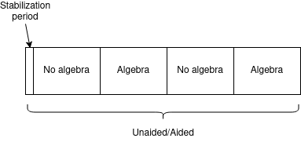

# Methods
We have investigated whether, during driving, an adaptive automation system can stabilize mental workload and lead to better driving or secondary task performance. To that end, we have adapted the ACT-R driving simulation made by Salvucci (2006) to allow for human user input. We kept the ACT-R model within the program, as it provided a ready-to-use autonomous driving system, the output of which could be used to assist our driving participants.

## Experiment
The driving experiment contained two experimental within-subjects conditions: aided and unaided. In the aided condition the adaptive automation system was enabled, while in the unaided condition the driver remained in full control of the vehicle. For every condition, participants performed a 10-minute driving session. 

Additionally, we manipulated the mental workload on the driver in both conditions to test whether the adaptive automation system took over control in appropriate moments, as well as how the increase in automation would impact the driver. We manipulated the workload with a secondary task, namely solving multiplication problems. These problems consisted of multiplying two numbers that could each range from 10 up to and including 21. The problems were presented to the participants aurally, with a text-to-speech synthesizer, rather than visually; this allowed participants to keep watching the road, which in turn allowed us to continue to monitor changes in their pupil size. Participants were instructed to respond to the problems with their voice. To create distinct switches between light and heavy mental workload, periods in which the participants were required to perform the secondary task alternated with periods within which they could focus solely on driving. Specifically, every condition session contained two 2.5-minute periods without a secondary task, and two 2.5-minute periods with a secondary task (see Figure X). During each 2.5-minute secondary task period participants had to answer ten questions, meaning that they had fifteen second to hear and answer to each multiplication problem. This results in participants having to answer 20 multiplication problems during each session.

To prevent any effect of specific multiplication problems on pupil size and/or driving performance, two different lists of twenty multiplication problems were created; one for each session. The order in which the lists were presented was counterbalanced across subjects. Similarly, to prevent any effects of learning or practice, we also counterbalanced the order of the aided/unaided conditions across participants. This yielded 2*2=4 different experiment run configurations, as detailed in Table X.

| Session 1 (automation condition) | Session 2 (automation condition) | Session 1 (multiplication list) | Session 2 (multiplication list) |
|----------------------------------|----------------------------------|---------------------------------|---------------------------------|
| Aided                            | Unaided                          | List 1                          | List 2                          |
| Aided                            | Unaided                          | List 2                          | List 1                          |
| Unaided                          | Aided                            | List 1                          | List 2                          |
| Unaided                          | Aided                            | List 2                          | List 1                          |

The adaptive automation system relied on changes in the pupil size to maintain an estimate of the mental workload currently experienced by the user (Kahnemann, 1973). The system, which was inspired from previous work by Mindakis and Lohan (2018), monitored the root mean square error (RMSE) between the average pupil size during the last 600 samples (short-term pupil trend) and the average pupil size during the last 15000 samples (long-term pupil trend). The system scheduled an automation increase, in case the short-term pupil trend measure exceeded 1.15 * the RMSE. Subsequently, once the short-term pupil trend returned to the long-term pupil trend, the system scheduled an automation decrease. After every automation change participants received a warning that the system would change the level of automation in 5 seconds. Following this change, no subsequent change to the automation level was permitted for additional 10 seconds.

An EyeLink Portable Duo (SRresearch) eye-tracking system was utilized to measure changes in the pupil size at 500 HZ. Samples were recorded for later offline analysis and made available online to the adaptive automation system. The remote tracking functionality of the eye-tracking system was used and only the participants' left eye was recorded. Obtained samples that contained a pupil size value of zero were not taken into account by the adaptive automation system.

## Analysis
For the pre-processing and offline analysis of the pupil data we relied on the recommendations by van Rij et al. (2019): Blink artifacts were removed from the raw data initially, which was then base-lined (note: the base-line differed per model which should probably be mentioned in a footnote or something) and down-sampled to 50 HZ. Three different additive mixed effect models (Wood, 2017) were fitted to investigate the research questions: 1) a model of pupil size changes during the entire session per condition, 2) a model of pupil size changes following a multiplication problem per condition, and 3) a model of pupil size changes following an increase in automation. Every model included a smooth term to model the effect of gaze location on the size of the pupil (van Rij et al., 2019) to account for the necessity of eye-movements during the experiment.

To analyse the effect of the session condition on secondary task performance, a generalized linear mixed effect model, for a binomial regression, was fitted. The response variable was a binary value indicating either a correct or incorrect response given for a multiplication problem. The fixed effect predictor was the session condition. A random intercept per participant was included to account for inter-individual differences. 

## Participants

We recruited eight participants, all of them either students or employees of the University of Groningen. Not all the participants owned a driving license, as the simulation vehicle was simple enough to operate without one. Before the experiment started, participants were told they were participating in a driving experiment involving adaptive automation based on their pupil size. We also explained the details of the secondary task, but added that at all times they were supposed to drive safely. In the context of the simulation, that meant to not drive left if there is no need to, to stick to the center of the lane, and to not deviate from the speed limits.
